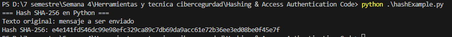
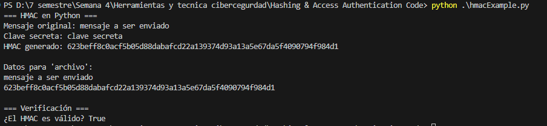

# 🔐 Hashing & HMAC en Python

Implementación de funciones criptográficas en Python para generar hashes SHA-256 y códigos de autenticación HMAC, como parte de la actividad de seguridad en mensajes.

---

## 📌 Objetivos
1. Generar hashes SHA-256 de cadenas de texto.
2. Simular un Message Authentication Code (HMAC) con claves secretas.
3. Verificar la integridad de mensajes mediante HMAC.

##  Pruebas

---

## 🚀 Cómo ejecutar
### Requisitos
- Terminal o consola.
